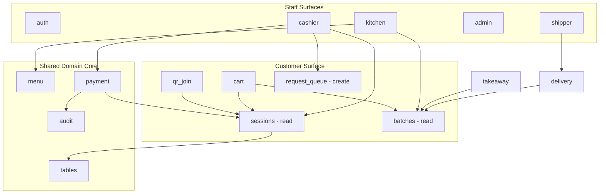
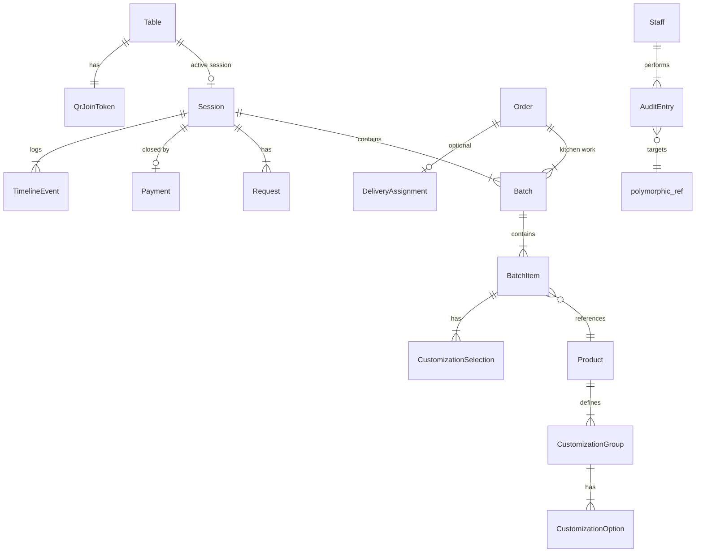

# ROMS — High-Level Architecture

> **Status:** Foundation document (Sprint 0)  
> **Source of truth for business rules:** [`PROJECT_CONTEXT.md`](./PROJECT_CONTEXT.md)  
> **This document defines structure and boundaries only.** No business logic, APIs, or database schemas are defined here.

---

## 1. Executive Summary

ROMS (Restaurant Operating Management System) is a **session-centric** dine-in platform with separate **order-centric** flows for Take Away and Delivery. The domain heart is:

```
Table → Session → Batch (immutable, append-only)
```

Staff roles (Cashier, Kitchen, Admin, Shipper) operate on authenticated surfaces. Customers are **anonymous** and interact only via **session-scoped tokens** after scanning a static QR join link.

This architecture adopts **Clean Architecture** with a **feature-first** folder layout, **repository pattern**, **dependency injection**, and **strong typing**. Business rules live in the domain layer and are enforced server-side; the client reflects and orchestrates them but never becomes the authority.

---

## 2. Domain Analysis

### 2.1 Core aggregates

| Aggregate | Scope | Lifecycle | Immutability |
|-----------|-------|-----------|--------------|
| **Table** | Physical dine-in seat | Available ↔ Occupied ↔ Reserved | Mutable (status only) |
| **Session** | One active dine-in visit per table | Open → Closed | Immutable after close |
| **Batch** | One confirmed order submission | Created on confirm | Always immutable |
| **Order** | Take Away / Delivery only | Created → Fulfilled → Paid/Closed | Historical records immutable |
| **Product** | Menu catalog | Available ↔ Out of Stock | Changes audited |
| **Request** | Customer call-staff item | Queued → Handled | Append-only log |
| **AuditEntry** | Cross-cutting | Append-only | Never edited |

### 2.2 Actor surfaces

| Actor | Auth | Primary entities | Key constraints |
|-------|------|------------------|-----------------|
| **Customer** | Session token (no login) | Session, Cart, Batch (read), Requests | Cannot close session, cancel batch, or edit past batches |
| **Cashier** | Staff auth | Table, Session, Order, Payment, Request Queue | Only role that closes dine-in payment (with Admin) |
| **Kitchen** | Staff auth | Batch queue, Item status, Product availability | Sees batch only — never session total, bill, or payment |
| **Admin** | Staff auth | All + force-close, reassignment | Force-close is audited |
| **Shipper** | Staff auth | Delivery orders only | Claim is exclusive; Admin/Cashier can reassign |

### 2.3 Order-type separation (non-negotiable)

```
Dine In:   Table → Session → Batch*
Take Away: Order → (kitchen work units)*
Delivery:  Order → (kitchen work units)* → Shipper claim
```

`*` Kitchen always receives **Batch** (or batch-equivalent work units). Take Away and Delivery must **not** reuse Session, but they **should** still emit Batch entities so the kitchen queue stays unified. See §4.2.

---

## 3. Business Rule Validation

### 3.1 Rules that are internally consistent

| Rule cluster | Implementable? | Enforcement layer |
|--------------|----------------|-------------------|
| One active Session per Table | ✅ | DB unique partial index + domain guard |
| Session ends only on payment or admin force-close | ✅ | State machine on Session |
| Batch immutability (append-only) | ✅ | No update endpoints; insert-only |
| QR token maps to table, not exposed in URL | ✅ | Opaque token table; rotate only via admin |
| Customer works with session token only | ✅ | Auth middleware scoped to session |
| Kitchen batch-only visibility | ✅ | API projection / DTO filtering |
| No split bill | ✅ | Single Payment record per Session |
| Full audit trail | ✅ | Append-only AuditEntry on every mutation |
| Structured customization → plain-text kitchen render | ✅ | Domain mapper at batch creation |
| Out-of-stock hides product immediately | ✅ | Realtime catalog sync (Sprint 13) |

### 3.2 Rules that need explicit design decisions (gaps)

These are **not contradictions** in `PROJECT_CONTEXT.md`, but they are **underspecified**. Each has a recommended resolution below so implementation stays consistent.

---

## 4. Contradictions, Gaps & Recommended Resolutions

### 4.1 Session token vs QR join token

**Gap:** QR uses `/join/<secure-token>` mapping to a table. Customers "only work with Session Token." It is unclear whether these are the same token or two tokens in sequence.

**Recommendation:**
- **QR Join Token** — long-lived, bound to `Table`, never rotates unless admin reprints QR.
- **Session Token** — short-lived (or session-lifetime), issued when a Session is created or joined.
- Flow: `join token → resolve table → find/create session → return session token`. All subsequent customer API calls use `session token`.

### 4.2 Kitchen queue for Take Away / Delivery

**Gap:** Kitchen "only receives Batch," but Take Away/Delivery use Order, not Session.

**Recommendation:** Introduce a **Batch parent reference** (exactly one of):

```
Batch.sessionId  OR  Batch.orderId
```

Kitchen queue query returns batches regardless of parent. Session totals and payment fields are never joined in kitchen projections. This preserves "do not mix" order types while keeping one kitchen pipeline.

### 4.3 Multi-customer dine-in at one table

**Gap:** Multiple customers can scan the same QR and join one Session. Cart ownership and confirm authority are undefined.

**Recommendation (MVP):**
- **One shared cart per Session** (optimistic concurrency via version field).
- Any joined customer device can add items; **any** customer can confirm (creates a new Batch).
- Conflicts resolved last-write-wins on cart lines with audit log of changes.
- Future enhancement: optional "device-local draft cart" merged on confirm (document now, defer implementation).

### 4.4 Table status state machine

**Gap:** When exactly does `Occupied` begin? How does `Reserved` interact with QR join?

**Recommendation:**

```
Available  → Occupied     when Session opens (QR or cashier)
Available  → Reserved     when cashier/admin reserves
Reserved   → Occupied     when Session opens (cashier only; QR join on Reserved → reject with message)
Occupied   → Available    only after Session closes (payment or force-close)
Reserved   → Available    when reservation cancelled or expires
```

No `Cleaning` status (per spec).

### 4.5 Item status: Preparing → Completed → Served

**Gap:** Who sets `Served`? Per-item or per-batch?

**Recommendation:**
- Status is **per BatchItem** (line item).
- Kitchen sets `Preparing` and `Completed`.
- Cashier or Kitchen sets `Served` (configurable per venue; default Kitchen for MVP).
- Customer order-progress view aggregates item statuses across all batches in the session.

### 4.6 Payment request vs payment close

**Gap:** Customer requests payment via Call Staff; Cashier closes payment. Overlap with Request Queue.

**Recommendation:**
- `RequestPayment` is a **Request Queue entry** (type = `payment`).
- Cashier sees request, opens bill view, records payment, **closes Session** in one atomic operation.
- No new orders accepted after cashier initiates payment close (soft lock); configurable grace period.

### 4.7 Admin force-close

**Gap:** Behavior for unpaid items undefined.

**Recommendation:**
- Force-close requires reason (enum + optional note).
- Open batches remain in history; payment recorded as `force_closed` with zero or manual adjustment.
- Table → `Available` immediately.
- Audit entry mandatory.

### 4.8 Delivery order lifecycle

**Gap:** States beyond "shipper claims" are undefined.

**Recommendation (minimal state machine):**

```
pending → claimed → picked_up → delivered
         ↘ unassigned (admin/cashier reassignment resets to pending)
```

### 4.9 Customization schema

**Gap:** Examples given (rice, soup, topping) but no structural model.

**Recommendation:**
- `Product` has ordered `CustomizationGroup` list (e.g., `rice_amount`, `soup`, `extras`).
- Each group has `type` (`single_select`, `multi_select`, `boolean`) and `Option` list with `kitchenLabel`.
- Batch stores **resolved selections** as structured JSON; kitchen receives pre-rendered plain text per line.

### 4.10 Bill calculation

**Gap:** Tax, service charge, discounts not mentioned.

**Recommendation:**
- Session stores `BillSnapshot` at close time (line items from all batches, adjustments, total).
- Pricing rules live in domain service; document extension points now, implement in Sprint 9.

---

## 5. Proposed Improvements to PROJECT_CONTEXT

| # | Improvement | Rationale |
|---|-------------|-----------|
| 1 | Distinguish QR join token vs session token | Removes auth ambiguity for customer API |
| 2 | Add `Batch.orderId` for non-dine-in kitchen flow | Unifies kitchen without mixing Session/Order |
| 3 | Document table status state machine | Prevents inconsistent Occupied/Reserved handling |
| 4 | Define shared-session cart policy | Enables multi-device dine-in without silent bugs |
| 5 | Specify delivery status enum | Shipper sprint needs bounded states |
| 6 | Clarify `Served` transition owner | Avoids kitchen/cashier UI mismatch |
| 7 | Add soft-lock on session during payment | Prevents orders after payment requested |
| 8 | Introduce `KitchenProjection` as explicit read model | Enforces "kitchen never sees bill" at architecture level |

---

## 6. Folder Structure

Feature-first Clean Architecture. Each feature is self-contained; shared code lives in `core/` and `shared/`.

```
lib/
├── main.dart                          # Entry point → delegates to app/bootstrap
│
├── app/                               # Application shell
│   ├── bootstrap.dart                 # runApp, zone guards, error hooks
│   ├── app.dart                       # Root widget
│   ├── di/                            # Dependency injection registry
│   │   └── injection.dart
│   └── router/                        # Route definitions & guards
│       ├── app_router.dart
│       ├── route_paths.dart
│       └── guards/
│           ├── auth_guard.dart
│           ├── role_guard.dart
│           └── session_guard.dart     # Customer session token guard
│
├── core/                              # Cross-cutting infrastructure (no business rules)
│   ├── constants/
│   ├── errors/                        # Failure types, exceptions
│   ├── extensions/
│   ├── network/                       # Client interfaces, interceptors (no endpoints yet)
│   ├── realtime/                      # WebSocket/SSE abstractions (Sprint 13)
│   ├── theme/
│   ├── utils/
│   └── widgets/                       # Design-system primitives only
│
├── shared/                            # Cross-feature domain contracts
│   └── domain/
│       ├── entities/                  # Shared enums & value objects (Status, Role, Money)
│       ├── repositories/              # Abstract repo interfaces spanning features
│       └── services/                  # Domain services used by multiple features
│
└── features/
    ├── auth/                          # Staff authentication & RBAC
    ├── tables/                        # Table CRUD, status, reservations
    ├── qr_join/                       # Join token resolution, deep link entry
    ├── sessions/                      # Session lifecycle, timeline, immutability
    ├── cart/                          # Pre-confirm cart (session-scoped)
    ├── batches/                       # Batch creation, immutability, item status
    ├── menu/                          # Catalog, product, customization definitions
    ├── kitchen/                       # Kitchen queue & item completion UI
    ├── request_queue/                 # Call-staff requests
    ├── payment/                       # Bill calculation, session close
    ├── takeaway/                      # Take Away order flow
    ├── delivery/                      # Delivery order flow
    ├── shipper/                       # Claim, pickup, delivery tracking
    ├── cashier/                       # Cashier shell & cross-feature orchestration
    ├── admin/                         # Admin panel, force-close, reassignment
    └── audit/                         # Audit log write/read interfaces
```

### 6.1 Per-feature internal layout

Every feature follows the same three layers:

```
features/<feature_name>/
├── domain/
│   ├── entities/
│   ├── repositories/          # Abstract interfaces
│   └── use_cases/               # Single-responsibility interactors
├── data/
│   ├── models/                  # DTOs / JSON models
│   ├── datasources/             # Remote / local source abstractions
│   └── repositories/            # Repository implementations
└── presentation/
    ├── state/                   # Providers / Bloc / Notifiers
    ├── pages/
    └── widgets/
```

**Dependency rule:** `presentation → domain ← data`. Domain has zero Flutter imports.

---

## 7. Feature Boundaries

### 7.1 Feature map



### 7.2 Ownership matrix

| Concern | Owning feature | Consumers |
|---------|----------------|-----------|
| Table status transitions | `tables` | `sessions`, `cashier`, `admin` |
| Session open/close | `sessions` | `qr_join`, `cashier`, `payment`, `admin` |
| Cart (pre-confirm) | `cart` | Customer presentation |
| Batch creation | `batches` | `cart` (trigger), `kitchen` (consume) |
| Menu & customization defs | `menu` | `cart`, `kitchen`, `cashier` |
| Product availability toggle | `menu` + `kitchen` UI | Customer catalog (realtime) |
| Request queue | `request_queue` | Customer (create), Cashier (handle) |
| Payment & bill | `payment` | `cashier`, `sessions` (close) |
| Take Away orders | `takeaway` | `cashier`, `kitchen` |
| Delivery orders | `delivery` | `cashier`, `shipper`, `kitchen` |
| Shipper claim | `shipper` | `delivery` |
| Audit entries | `audit` | All features (via domain events / use cases) |
| Staff auth & roles | `auth` | All staff features |

### 7.3 Cross-feature communication rules

1. **No feature imports another feature's `data/` or `presentation/` layer.**
2. Cross-feature calls go through **domain use cases** or **shared domain services**.
3. **Customer session scope** is resolved once in `qr_join` / `sessions` and passed via router extra or scoped provider — not global singletons.
4. **Kitchen** subscribes only to `batches` + `menu` (availability); never imports `payment` or `sessions` presentation.
5. **Audit** is invoked from use cases, not UI widgets.

---

## 8. State Management Strategy

### 8.1 Recommended stack

| Layer | Choice | Reason |
|-------|--------|--------|
| DI | `riverpod` + `riverpod_annotation` | Compile-safe, testable, integrates with Flutter lifecycle |
| State | `flutter_riverpod` (Notifier / AsyncNotifier) | Supports async flows, caching, family providers |
| Models | `freezed` + `json_serializable` | Immutable domain/DTO types aligned with batch/session immutability |
| Equality | `freezed` built-in | Prevents unnecessary rebuilds |

> Dependencies are planned for Sprint 0/1 setup; not added until foundation sprint begins implementation.

### 8.2 Provider scoping conventions

| Scope | Examples | Lifecycle |
|-------|----------|-----------|
| **App-wide** | Theme, auth session, connectivity | Lives for app lifetime |
| **Role shell** | Cashier dashboard, Kitchen board | Lives while staff role screen mounted |
| **Session-scoped** | Customer cart, order progress | Created on QR join; disposed on session close |
| **Entity-scoped (family)** | `batchProvider(batchId)`, `tableProvider(tableId)` | Cached with auto-dispose |

### 8.3 State categories per feature

| Feature | State type | Notes |
|---------|------------|-------|
| `auth` | Sync + async | Staff token refresh |
| `sessions` | Async stream | Realtime timeline (Sprint 13) |
| `cart` | Optimistic mutable | Version field for conflict detection |
| `batches` | Immutable list | Append-only; never patch in UI state |
| `kitchen` | Polling/stream | Simple, fast-updating queue |
| `payment` | Transactional async | Single in-flight close operation |
| `menu` | Cached async | Invalidated on availability change |

### 8.4 Immutability in client state

Closed sessions and confirmed batches are stored as **immutable snapshots** in client state. UI never offers edit affordances for historical batches; admin force-close creates a new terminal state, not an in-place mutation.

---

## 9. Navigation Strategy

### 9.1 Router

Use **`go_router`** with:
- Declarative route table in `app/router/`
- **Deep link** support for `/join/:token` (customer web/tablet)
- **Role-based redirects** after staff login
- **Auth guards** and **session guards** as `redirect` callbacks

### 9.2 Route surfaces

| Surface | Base path | Entry |
|---------|-----------|-------|
| Customer | `/join/:joinToken` | QR scan |
| Customer (in-session) | `/s/:sessionToken/...` | After join |
| Staff login | `/login` | App launch (staff builds) |
| Kitchen | `/kitchen` | Role guard |
| Cashier | `/cashier` | Role guard |
| Admin | `/admin` | Role guard |
| Shipper | `/shipper` | Role guard |

### 9.3 Multi-app vs single codebase

**Recommendation:** Single codebase with **build flavors** or **entry-point files**:

```
lib/main_customer.dart
lib/main_staff.dart
```

Staff app uses role-based shell after login. Customer build exposes only join + session routes (tree-shaken / guarded). This avoids three separate repos while keeping UX isolated.

### 9.4 Navigation rules

1. Customer cannot navigate to staff routes (compile-time flavor + runtime guard).
2. Session close redirects customer to a static "Thank you" page; session token invalidated.
3. Kitchen uses flat, full-screen routes — no deep navigation stacks (simplicity requirement).
4. Back navigation on cashier must not bypass payment close confirmation.

---

## 10. Model Relationships

### 10.1 Entity relationship diagram



### 10.2 Key cardinality rules

| Relationship | Cardinality | Rule |
|--------------|-------------|------|
| Table → active Session | 0..1 | Enforced at creation |
| Session → Batch | 1..* | At least one batch to close with payment (or force-close) |
| Batch → Session OR Order | XOR | Exactly one parent |
| BatchItem → status | 1 | Preparing → Completed → Served |
| Order (delivery) → Shipper | 0..1 | Exclusive claim when assigned |
| Product → availability | 1 | Available or OutOfStock |

### 10.3 Shared value objects (`shared/domain/entities/`)

- `TableStatus` — `available`, `occupied`, `reserved`
- `SessionStatus` — `open`, `paymentPending`, `closed`
- `BatchItemStatus` — `preparing`, `completed`, `served`
- `RequestType` — `payment`, `assistance`, `extraWater`, `extraBowl`, `extraSpoon`
- `OrderType` — `dineIn`, `takeAway`, `delivery`
- `Role` — `cashier`, `kitchen`, `admin`, `shipper`
- `Money`, `Quantity`, `SessionToken`, `JoinToken`

### 10.4 Domain services (not entities)

| Service | Responsibility |
|---------|----------------|
| `BillCalculator` | Aggregates batch lines into bill snapshot |
| `CustomizationRenderer` | Structured selections → kitchen plain text |
| `SessionGuard` | Validates open session, soft-lock rules |
| `TableStateMachine` | Legal table status transitions |
| `AuditRecorder` | Append audit entry for every mutation |
| `KitchenProjection` | Batch DTO stripped of payment/session totals |

---

## 11. Scalability Considerations

### 11.1 Backend alignment (future)

Client architecture assumes a backend that provides:
- REST or gRPC for commands/queries
- Realtime channel for menu availability, batch status, request queue (Sprint 13)
- Server-authoritative enforcement of all business rules in §3

Repository interfaces in `domain/` are transport-agnostic so API and realtime sources can be swapped.

### 11.2 Horizontal scaling paths

| Dimension | Strategy |
|-----------|----------|
| New order type | New feature module + `Order` extension; reuse `batches` kitchen pipeline |
| New staff role | Add `Role` enum + route guard + feature visibility matrix |
| Multi-location | `VenueId` on all aggregates; scope providers by venue |
| Offline kitchen | Local queue datasource with sync conflict resolution (future) |
| Customer PWA | `main_customer.dart` web build; join deep links |

### 11.3 Performance

- Kitchen board: paginated batch stream, item-level diff updates
- Customer menu: cache with ETag; push invalidation on out-of-stock
- Session timeline: event-sourced append log (read-optimized projection)
- Audit: write-async, never blocks primary user flow

### 11.4 Testing pyramid

| Layer | Target |
|-------|--------|
| Domain use cases | 100% rule coverage (table/session/batch invariants) |
| Repository contracts | Mock datasource integration tests |
| Presentation | Widget tests for kitchen simplicity, customer cart |
| E2E | QR join → order → kitchen → payment golden path |

### 11.5 Package extraction (future)

When codebase grows, extract:

```
packages/
├── roms_core/           # shared domain + errors
├── roms_ui/             # design system
└── roms_api_client/     # generated API client
```

Features remain in `lib/features/` until team size or build times justify extraction.

---

## 12. Sprint Alignment

| Roadmap sprint | Primary features touched |
|----------------|--------------------------|
| Sprint 0 — Foundation | `app/`, `core/`, folder scaffold, DI, router shell |
| Sprint 1 — Authentication | `auth` |
| Sprint 2 — Table & Session | `tables`, `sessions` |
| Sprint 3 — QR Flow | `qr_join` |
| Sprint 4 — Menu & Customization | `menu` |
| Sprint 5 — Cart & Batch | `cart`, `batches` |
| Sprint 6 — Kitchen Queue | `kitchen` |
| Sprint 7 — Menu Availability | `menu`, realtime |
| Sprint 8 — Request Queue | `request_queue` |
| Sprint 9 — Cashier | `cashier`, `payment` |
| Sprint 10 — Take Away | `takeaway` |
| Sprint 11 — Delivery | `delivery` |
| Sprint 12 — Admin | `admin` |
| Sprint 13 — Realtime | `core/realtime` |
| Sprint 14 — Polish | Cross-cutting |

---

## 13. Explicit Non-Goals (This Phase)

The following are **intentionally deferred**:

- [ ] Business logic implementation
- [ ] API endpoint definitions
- [ ] Database schema
- [ ] UI screens beyond shell
- [ ] Realtime transport implementation

---

## 14. Next Steps (Sprint 0 Implementation Checklist)

When implementation begins:

1. Add `flutter_riverpod`, `go_router`, `freezed`, `json_serializable` to `pubspec.yaml`
2. Wire `app/bootstrap.dart` and `app/router/app_router.dart`
3. Register repository interfaces in `app/di/injection.dart` (stub implementations)
4. Add `analysis_options.yaml` strict lints for domain layer import boundaries
5. Resolve open questions in §4 with product owner sign-off
6. Update `PROJECT_CONTEXT.md` with accepted recommendations from §5

---

## 15. Architecture Hardening (Sprint 1.5)

Sprint 1.5 strengthens the foundation without adding business features. The target call stack for every future action is:

```
UI → Provider → UseCase → Repository → Datasource
```

### 15.1 Why each abstraction exists

| Abstraction | Location | Purpose |
|-------------|----------|---------|
| **UseCase** | `lib/application/usecases/` | Single-responsibility orchestrators. UI never calls repositories directly. |
| **Result\<T\>** | `lib/core/result/` | Typed success/failure at repository and use-case boundaries. Avoids throwing through layers. Integrates with existing `Failure` hierarchy. |
| **Mapper** | `lib/application/mappers/` | DTO ↔ Entity conversion stays out of widgets and repositories. |
| **Validator** | `lib/application/validators/` | Input validation before domain services run. Not in widgets. |
| **Policy** | `lib/application/policies/` | Business rule decisions (session state, payment, kitchen visibility, RBAC). |
| **Clock / TimeProvider** | `lib/core/clock/`, `lib/core/time/` | Deterministic timestamps for QR expiry, session timeout, batch creation, payment. Never `DateTime.now()` in business code. |
| **IdGenerator** | `lib/core/id/` | Swappable UUID generation for tests (`FakeIdGenerator`). |
| **DomainEvent** | `lib/domain/events/` | Append-only event contracts for future realtime (Sprint 13). No event bus yet. |
| **DI Modules** | `lib/app/di/modules/` | Feature-scoped GetIt registration instead of one global god-file. |
| **Datasource** | `lib/data/datasources/` | Remote / local / memory abstractions repositories depend on. |
| **Repository impl shells** | `lib/data/repositories/` | Scalable per-aggregate folders ready for Sprint 2+. |
| **AppLifecycleService** | `lib/core/lifecycle/` | Foreground/background hooks for future reconnect logic. |
| **ConnectivityService** | `lib/core/connectivity/` | Offline mode plug-in point. |
| **FeatureFlags** | `lib/core/feature_flags/` | Compile-time toggles for realtime, analytics, offline. |

### 15.2 Layer import rules

| Layer | May import | Must not import |
|-------|------------|-----------------|
| `domain/` | Pure Dart, `freezed`, `json_annotation` | `package:flutter`, widgets, `data/` |
| `application/` | `domain/`, `core/` | `presentation/`, Flutter widgets |
| `data/` | `domain/`, `core/` | `features/*/presentation/` |
| `features/*/presentation/` | `application/`, `domain/`, `core/`, shared widgets | `data/` concrete implementations (use DI) |

Enforced by `test/domain/domain_purity_test.dart` and documented in `analysis_options.yaml`.

### 15.3 Backward compatibility

- Existing domain repository **interfaces** are unchanged (still return `Future<T>`).
- Implementations use `RepositoryResult` helpers internally and map to `Result` at the **UseCase** boundary.
- Sprint 2+ may introduce Result-native repository variants without breaking callers.

### 15.4 Modular DI composition

`Injection.init()` composes modules in order:

```
CoreModule → PaymentModule → AuthModule → MenuModule → SessionModule
  → KitchenModule → RequestModule → DeliveryModule → AdminModule
```

---

*Document version: 1.1 — Sprint 1.5 architecture hardening*
