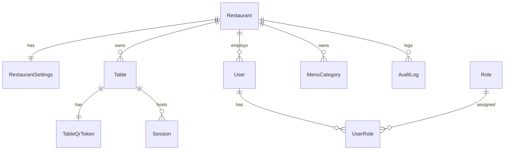
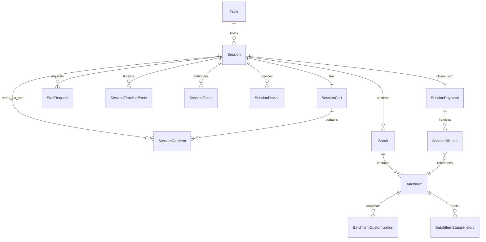
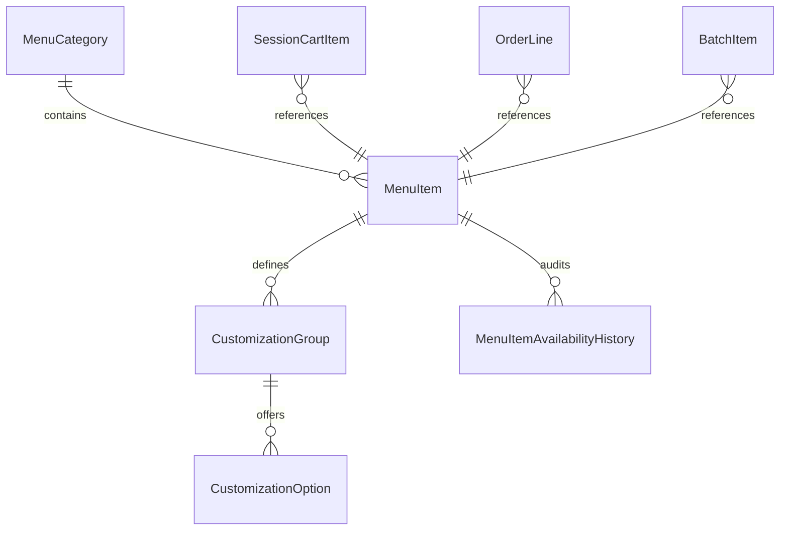
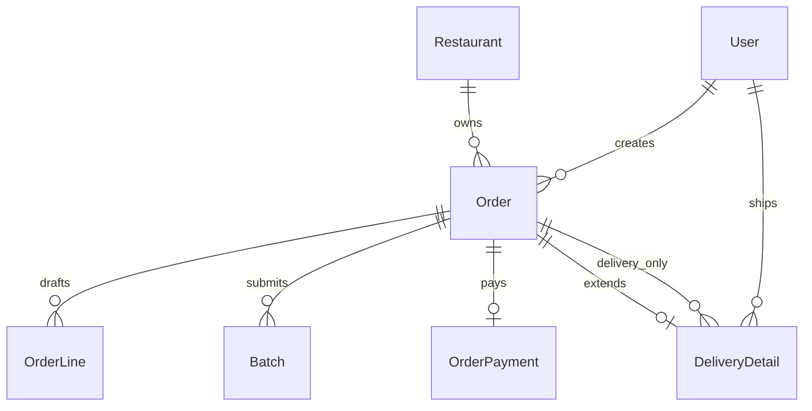
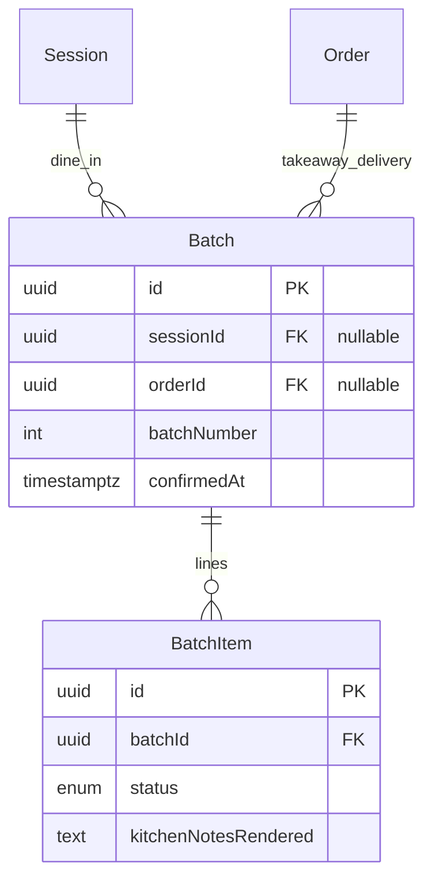

# ROMS — Domain Model & Entity Relationship Design

> **Status:** Architecture specification (pre-implementation)  
> **Source of truth for business rules:** [`PROJECT_CONTEXT.md`](./PROJECT_CONTEXT.md)  
> **Companion:** [`ARCHITECTURE.md`](./ARCHITECTURE.md) (application layer boundaries)

**Scope:** Domain model, ERD, enumerations, relationships, normalization, scalability, and production-readiness review.

**Out of scope:** Flutter UI, API endpoints, backend code, SQL migrations.

---

# 1. Domain Analysis

## 1.1 System mental model

ROMS is a **multi-tenant restaurant operating platform** with two **strictly separated** order pipelines:

```
DINE IN:    Restaurant → Table → Session → Batch* → Kitchen
TAKE AWAY:  Restaurant → Order → Batch* → Kitchen → Payment
DELIVERY:   Restaurant → Order → Batch* → Kitchen → Delivery → Shipper
```

`*` Every customer/cashier **confirmation** produces exactly **one immutable Batch**. Kitchen **only** consumes `Batch` / `BatchItem` projections. Kitchen **never** joins `SessionPayment`, `OrderPayment`, or bill totals.

The word **Order** in ROMS means **Take Away or Delivery only**. It must never be conflated with dine-in `Session`.

---

## 1.2 Entity existence rationale

### Restaurant (tenant root)
**Why:** SaaS platform must isolate data per venue from day one. Every operational row is `restaurantId`-scoped. Enables franchise, cloud multi-tenancy, and per-restaurant configuration without schema rework.

**Relationships:** Owns tables, menu, users, sessions, orders, audit logs.

---

### Table
**Why:** Physical dine-in anchor. Status (`available`, `occupied`, `reserved`) is operational truth for floor staff. A table may have many **historical** sessions but **at most one active** session.

**Relationships:** Belongs to `Restaurant`. Has one permanent `TableQrToken`. Has zero or one active `Session`. Has many closed `Session` records.

**Business rules enforced:**
- `occupied` when session opens; `available` only after session closes (payment or force-close).
- No `cleaning` status.

---

### TableQrToken
**Why:** Physical QR is **fixed** and must **not** expose `tableId`. Opaque token resolves server-side: `/join/<token> → table`.

**Relationships:** 1:1 with `Table` (while QR is active). Token rotation creates a new row; old token deactivated (audit logged), QR sticker unchanged only if token is permanent by design — spec says QR never changes, so token row is created once and never rotated unless security breach.

---

### Session
**Why:** Heart of dine-in. Aggregates customer activity for one table visit: cart (pre-confirm), batches (post-confirm), timeline, staff requests, and closing payment snapshot.

**Relationships:** Belongs to `Table` and `Restaurant`. Has many `Batch`, `StaffRequest`, `SessionTimelineEvent`, `SessionDevice`. Has zero or one `SessionPayment` (created at close). Has one `SessionCart` while open.

**Business rules enforced:**
- Dine-in only. Never linked to Take Away / Delivery.
- Immutable after close (no updates to child batches; only append-only audit).
- Ends only via cashier payment close or admin force-close.

---

### SessionToken
**Why:** Spec: *"Customer only works with Session Token."* This is **distinct** from the QR join token. Join token identifies **table**; session token authorizes **customer API access** to an open session.

**Relationships:** Issued by `Session` (1:1 active token per session, or allow rotation on security event).

**Design challenge resolved:** Without this separation, exposing join token post-session-creation would let anyone with QR hijack session scope. Two-token model is mandatory.

---

### SessionCart / SessionCartItem
**Why:** Pre-confirm mutable state. Spec allows view menu → add cart → confirm. Cart is **not** a Batch until confirmed. Separating cart from batch preserves batch immutability.

**Relationships:** `Session` 1:1 `SessionCart` 1:N `SessionCartItem`. Each line references `MenuItem` and stores structured customization JSON (draft).

**Business rules enforced:**
- Optimistic concurrency via `version` on `SessionCart` (multi-device dine-in).
- Confirm atomically: create `Batch` + `BatchItem` rows, append timeline, clear cart.

---

### Batch
**Why:** Atomic kitchen work unit. One per confirmation. Immutable forever. Unifies kitchen queue across dine-in, takeaway, and delivery without mixing session and order semantics.

**Relationships:** Parent is **exactly one of** `Session` OR `Order` (XOR). Has many `BatchItem`. Has sequential `batchNumber` per parent.

**Business rules enforced:**
- Never update, never merge, never delete.
- Kitchen projection joins only `Batch`, `BatchItem`, `Table` (via session), never payment.

---

### BatchItem
**Why:** Line-level kitchen trackable unit. Status transitions (`preparing`, `completed`, `served`) are per item. Customer progress view aggregates across batches in session.

**Relationships:** Belongs to `Batch`. References `MenuItem` (catalog FK) plus **snapshot** fields (name, unit price). Has many `BatchItemCustomization` (structured, immutable).

**Intentional denormalization:** `menuItemNameSnapshot`, `unitPriceSnapshot`, `kitchenNotesRendered` freeze catalog state at confirmation.

---

### BatchItemCustomization
**Why:** Spec forbids free-text customization storage. Structured selections (rice amount, soup, extras) are persisted relationally for reporting; rendered plain text is stored for kitchen speed.

**Relationships:** N:1 `BatchItem`. References `CustomizationGroup` / `CustomizationOption` keys at time of order.

---

### Order (Take Away & Delivery only)
**Why:** Standalone transactional document for non-dine-in channels. Cashier creates and closes. Never references `Session` or `Table`.

**Relationships:** Belongs to `Restaurant`. Has 1:N `Batch`. Has 0:1 `OrderPayment`. Has 0:1 `DeliveryDetail` (delivery only). Created by `User` (cashier).

**Business rules enforced:**
- `orderType ∈ {takeaway, delivery}`.
- Do not mix with session pipeline.

---

### OrderLine (draft cart for Order)
**Why:** Symmetry with `SessionCartItem`. Cashier builds order before kitchen submission. On submit → create `Batch`. For most takeaway/delivery flows this is a single confirmation, but schema supports multiple batches if business later allows add-on confirmations.

**Relationships:** `Order` 1:N `OrderLine` until submitted.

---

### DeliveryDetail
**Why:** Delivery-specific state and shipper assignment without polluting takeaway rows or kitchen batch model.

**Relationships:** 1:1 `Order` (where `orderType = delivery`). Optional `User` (shipper). Status machine: `ready → claimed → delivering → completed`.

**Business rules enforced:**
- Only delivery orders visible to shipper.
- Claim is exclusive (row-level lock + `shipperUserId`).
- Admin/cashier reassignment clears claim, returns to `ready`.

---

### MenuCategory / MenuItem
**Why:** Catalog structure. `MenuItem` is the sellable product with base price, category, availability.

**Relationships:** `Restaurant` → `MenuCategory` → `MenuItem` → `CustomizationGroup` → `CustomizationOption`.

**Business rules enforced:**
- `out_of_stock` hides from customer catalog immediately.
- Kitchen toggles availability (audited).

---

### CustomizationGroup / CustomizationOption
**Why:** Structured customization schema. Groups define selection type (single, multi, boolean); options carry price deltas and `kitchenLabel` for rendering.

**Relationships:** Owned by `MenuItem`. Referenced at confirmation time by `BatchItemCustomization`.

---

### StaffRequest (Request Queue)
**Why:** Customer-initiated service signals (payment, assistance, extra water/bowl/spoon) that cashier fulfills. Payment request is **not** payment itself — it is a queue item.

**Relationships:** Belongs to `Session` only (dine-in customer surface). Handled by `User` (cashier).

---

### SessionPayment / OrderPayment
**Why:** Payment is a **terminal event** producing immutable financial snapshot. Separated from `Session`/`Order` header to preserve closed-record immutability and support audit.

**Relationships:**
- `Session` 1:0..1 `SessionPayment` (no split bill — exactly one).
- `Order` 1:0..1 `OrderPayment`.

**Business rules enforced:**
- Only cashier/admin may create.
- `SessionPayment` closes session atomically.
- Force-close uses `closeType = force_closed` with reason.

---

### SessionTimelineEvent
**Why:** Spec: session stores timeline. Append-only event log for operational visibility (session opened, batch confirmed, request raised, payment closed).

**Relationships:** N:1 `Session`.

---

### User / UserRole
**Why:** Staff authentication. Customers never have `User` rows. Roles: `admin`, `cashier`, `kitchen`, `shipper`.

**Relationships:** `User` N:M `Role` via `UserRole`. Scoped to `Restaurant` (or platform admin for multi-restaurant operators — future).

---

### AuditLog
**Why:** Spec: everything important logged. Append-only, polymorphic reference to any entity. Supports compliance and debugging without mutating domain rows.

**Relationships:** Scoped to `Restaurant`. References `actor` (`User` or `customer_session` or `system`).

---

### SessionDevice (added — multi-customer dine-in)
**Why:** Multiple phones scan same QR. Optional but valuable for audit (which device confirmed batch), rate limiting, and future per-device draft carts.

**Relationships:** N:1 `Session`.

---

### IdempotencyKey (added — distributed safety)
**Why:** Confirm cart / close payment / shipper claim must be idempotent under retries and mobile flaky networks. Production SaaS requirement not stated in spec but violates no rule.

**Relationships:** Transient table keyed by client mutation ID.

---

# 2. Entity List

## 2.1 Tenant & configuration
| # | Entity | Purpose |
|---|--------|---------|
| 1 | `Restaurant` | Multi-tenant root |
| 2 | `RestaurantSettings` | Per-venue operational config |

## 2.2 Floor & dine-in
| # | Entity | Purpose |
|---|--------|---------|
| 3 | `Table` | Physical table |
| 4 | `TableQrToken` | Opaque QR join token |
| 5 | `Session` | Active dine-in visit |
| 6 | `SessionToken` | Customer auth token for session |
| 7 | `SessionDevice` | Customer device joined to session |
| 8 | `SessionCart` | Pre-confirm mutable cart |
| 9 | `SessionCartItem` | Cart line |
| 10 | `SessionTimelineEvent` | Session append-only timeline |
| 11 | `StaffRequest` | Call-staff / request queue |

## 2.3 Kitchen work units
| # | Entity | Purpose |
|---|--------|---------|
| 12 | `Batch` | Immutable confirmed submission |
| 13 | `BatchItem` | Kitchen-trackable line item |
| 14 | `BatchItemCustomization` | Structured customization snapshot |

## 2.4 Non-dine-in orders
| # | Entity | Purpose |
|---|--------|---------|
| 15 | `Order` | Take Away / Delivery order |
| 16 | `OrderLine` | Pre-submit order draft lines |
| 17 | `DeliveryDetail` | Delivery lifecycle & shipper |
| 18 | `OrderPayment` | Takeaway/delivery payment snapshot |

## 2.5 Menu & customization
| # | Entity | Purpose |
|---|--------|---------|
| 19 | `MenuCategory` | Menu grouping |
| 20 | `MenuItem` | Sellable product |
| 21 | `CustomizationGroup` | Customization question group |
| 22 | `CustomizationOption` | Selectable option |

## 2.6 Payment (dine-in)
| # | Entity | Purpose |
|---|--------|---------|
| 23 | `SessionPayment` | Session bill & close snapshot |
| 24 | `SessionBillLine` | Itemized bill breakdown at close |

## 2.7 Staff & security
| # | Entity | Purpose |
|---|--------|---------|
| 25 | `User` | Staff account |
| 26 | `Role` | Role catalog |
| 27 | `UserRole` | User-role assignment |

## 2.8 Cross-cutting
| # | Entity | Purpose |
|---|--------|---------|
| 28 | `AuditLog` | Global append-only audit |
| 29 | `BatchItemStatusHistory` | Item status transition log |
| 30 | `MenuItemAvailabilityHistory` | Availability change log |
| 31 | `IdempotencyRecord` | Mutation idempotency guard |

**Total: 31 entities**

---

# 3. Entity Fields

> **ID convention:** `UUID` (v7 preferred for time-ordering) for all primary keys.  
> **Timestamps:** `TIMESTAMPTZ` (UTC). All tables have `createdAt`; mutable tables add `updatedAt`.  
> **Money:** `DECIMAL(12,2)` — never `FLOAT`. Currency in `RestaurantSettings.defaultCurrency` (ISO 4217).  
> **Soft delete:** `isActive BOOLEAN` where noted; historical rows never hard-deleted.

---

## 3.1 Restaurant

| Field | Type | Nullable | Default | Explanation |
|-------|------|----------|---------|-------------|
| `id` | UUID | NO | gen | Primary key |
| `name` | VARCHAR(200) | NO | — | Display name |
| `slug` | VARCHAR(100) | NO | — | URL-safe identifier, unique globally |
| `timezone` | VARCHAR(64) | NO | `UTC` | Local time display |
| `isActive` | BOOLEAN | NO | `true` | Tenant enabled |
| `createdAt` | TIMESTAMPTZ | NO | `now()` | — |
| `updatedAt` | TIMESTAMPTZ | NO | `now()` | — |

**Indexes:** `UNIQUE(slug)`

---

## 3.2 RestaurantSettings

| Field | Type | Nullable | Default | Explanation |
|-------|------|----------|---------|-------------|
| `id` | UUID | NO | gen | PK |
| `restaurantId` | UUID | NO | — | FK → Restaurant, UNIQUE |
| `defaultCurrency` | CHAR(3) | NO | — | ISO 4217 |
| `taxRateBps` | INT | NO | `0` | Tax in basis points (100 = 1%) |
| `serviceChargeBps` | INT | NO | `0` | Service charge basis points |
| `sessionTokenTtlMinutes` | INT | NO | `480` | Customer session token lifetime |
| `allowQrOnReservedTable` | BOOLEAN | NO | `false` | QR join rejected when reserved |
| `paymentSoftLockEnabled` | BOOLEAN | NO | `true` | Block new confirms after payment request |
| `createdAt` | TIMESTAMPTZ | NO | `now()` | — |
| `updatedAt` | TIMESTAMPTZ | NO | `now()` | — |

---

## 3.3 Table

| Field | Type | Nullable | Default | Explanation |
|-------|------|----------|---------|-------------|
| `id` | UUID | NO | gen | PK |
| `restaurantId` | UUID | NO | — | FK → Restaurant |
| `label` | VARCHAR(50) | NO | — | e.g. `T12` |
| `capacity` | SMALLINT | NO | `4` | Seats |
| `status` | ENUM TableStatus | NO | `available` | Operational status |
| `sortOrder` | INT | NO | `0` | Floor plan ordering |
| `isActive` | BOOLEAN | NO | `true` | Soft delete |
| `createdAt` | TIMESTAMPTZ | NO | `now()` | — |
| `updatedAt` | TIMESTAMPTZ | NO | `now()` | — |

**Indexes:** `UNIQUE(restaurantId, label)`, `INDEX(restaurantId, status)`

---

## 3.4 TableQrToken

| Field | Type | Nullable | Default | Explanation |
|-------|------|----------|---------|-------------|
| `id` | UUID | NO | gen | PK |
| `restaurantId` | UUID | NO | — | FK → Restaurant |
| `tableId` | UUID | NO | — | FK → Table, UNIQUE (one active QR per table) |
| `tokenHash` | VARCHAR(128) | NO | — | SHA-256 of opaque join token |
| `isActive` | BOOLEAN | NO | `true` | Deactivate on compromise |
| `createdAt` | TIMESTAMPTZ | NO | `now()` | — |

**Indexes:** `UNIQUE(tokenHash)`, `UNIQUE(tableId)`

---

## 3.5 Session

| Field | Type | Nullable | Default | Explanation |
|-------|------|----------|---------|-------------|
| `id` | UUID | NO | gen | PK |
| `restaurantId` | UUID | NO | — | FK → Restaurant |
| `tableId` | UUID | NO | — | FK → Table |
| `sessionNumber` | BIGINT | NO | — | Human-readable sequential per restaurant |
| `status` | ENUM SessionStatus | NO | `open` | Lifecycle |
| `openedVia` | ENUM SessionOpenedVia | NO | — | `qr_scan` or `cashier_manual` |
| `openedByUserId` | UUID | YES | — | FK → User when cashier opens |
| `paymentSoftLock` | BOOLEAN | NO | `false` | True after payment request accepted |
| `openedAt` | TIMESTAMPTZ | NO | `now()` | — |
| `closedAt` | TIMESTAMPTZ | YES | — | Set on payment/force-close |
| `createdAt` | TIMESTAMPTZ | NO | `now()` | — |
| `updatedAt` | TIMESTAMPTZ | NO | `now()` | — |

**Constraints:**
- `UNIQUE PARTIAL INDEX (tableId) WHERE status IN ('open', 'payment_pending')` — one active session per table.
- After `closed`, row updates forbidden except via DB trigger rejection.

---

## 3.6 SessionToken

| Field | Type | Nullable | Default | Explanation |
|-------|------|----------|---------|-------------|
| `id` | UUID | NO | gen | PK |
| `sessionId` | UUID | NO | — | FK → Session |
| `tokenHash` | VARCHAR(128) | NO | — | SHA-256 of bearer token |
| `expiresAt` | TIMESTAMPTZ | NO | — | Expiry |
| `revokedAt` | TIMESTAMPTZ | YES | — | Invalidated on session close |
| `createdAt` | TIMESTAMPTZ | NO | `now()` | — |

**Indexes:** `UNIQUE(tokenHash)`, `INDEX(sessionId)`

---

## 3.7 SessionDevice

| Field | Type | Nullable | Default | Explanation |
|-------|------|----------|---------|-------------|
| `id` | UUID | NO | gen | PK |
| `sessionId` | UUID | NO | — | FK → Session |
| `deviceFingerprint` | VARCHAR(128) | NO | — | Client-generated stable ID |
| `lastSeenAt` | TIMESTAMPTZ | NO | `now()` | — |
| `createdAt` | TIMESTAMPTZ | NO | `now()` | — |

**Indexes:** `UNIQUE(sessionId, deviceFingerprint)`

---

## 3.8 SessionCart

| Field | Type | Nullable | Default | Explanation |
|-------|------|----------|---------|-------------|
| `id` | UUID | NO | gen | PK |
| `sessionId` | UUID | NO | — | FK → Session, UNIQUE |
| `version` | INT | NO | `1` | Optimistic concurrency |
| `updatedAt` | TIMESTAMPTZ | NO | `now()` | — |
| `createdAt` | TIMESTAMPTZ | NO | `now()` | — |

---

## 3.9 SessionCartItem

| Field | Type | Nullable | Default | Explanation |
|-------|------|----------|---------|-------------|
| `id` | UUID | NO | gen | PK |
| `sessionCartId` | UUID | NO | — | FK → SessionCart |
| `menuItemId` | UUID | NO | — | FK → MenuItem |
| `quantity` | SMALLINT | NO | `1` | CHECK `quantity > 0` |
| `selectionsJson` | JSONB | NO | `{}` | Structured draft customizations |
| `unitPriceSnapshot` | DECIMAL(12,2) | NO | — | Price at add-to-cart time |
| `createdAt` | TIMESTAMPTZ | NO | `now()` | — |
| `updatedAt` | TIMESTAMPTZ | NO | `now()` | — |

---

## 3.10 SessionTimelineEvent

| Field | Type | Nullable | Default | Explanation |
|-------|------|----------|---------|-------------|
| `id` | UUID | NO | gen | PK |
| `sessionId` | UUID | NO | — | FK → Session |
| `eventType` | ENUM SessionTimelineEventType | NO | — | — |
| `payloadJson` | JSONB | NO | `{}` | Event-specific data |
| `actorType` | ENUM ActorType | NO | — | user / customer_session / system |
| `actorId` | UUID | YES | — | Polymorphic actor reference |
| `occurredAt` | TIMESTAMPTZ | NO | `now()` | — |

**Indexes:** `INDEX(sessionId, occurredAt)`

---

## 3.11 StaffRequest

| Field | Type | Nullable | Default | Explanation |
|-------|------|----------|---------|-------------|
| `id` | UUID | NO | gen | PK |
| `restaurantId` | UUID | NO | — | FK → Restaurant |
| `sessionId` | UUID | NO | — | FK → Session |
| `requestType` | ENUM RequestType | NO | — | — |
| `status` | ENUM RequestStatus | NO | `pending` | — |
| `note` | VARCHAR(500) | YES | — | Optional customer note |
| `requestedAt` | TIMESTAMPTZ | NO | `now()` | — |
| `handledAt` | TIMESTAMPTZ | YES | — | — |
| `handledByUserId` | UUID | YES | — | FK → User (cashier) |
| `createdAt` | TIMESTAMPTZ | NO | `now()` | — |

**Indexes:** `INDEX(restaurantId, status, requestedAt)`

---

## 3.12 Batch

| Field | Type | Nullable | Default | Explanation |
|-------|------|----------|---------|-------------|
| `id` | UUID | NO | gen | PK |
| `restaurantId` | UUID | NO | — | FK → Restaurant |
| `sessionId` | UUID | YES | — | FK → Session (dine-in) |
| `orderId` | UUID | YES | — | FK → Order (takeaway/delivery) |
| `batchNumber` | INT | NO | — | Sequential per session/order |
| `confirmedAt` | TIMESTAMPTZ | NO | `now()` | — |
| `confirmedByActorType` | ENUM ActorType | NO | — | — |
| `confirmedByActorId` | UUID | YES | — | Device or user |
| `createdAt` | TIMESTAMPTZ | NO | `now()` | Immutable after insert |

**Constraints:**
- `CHECK ((sessionId IS NOT NULL AND orderId IS NULL) OR (sessionId IS NULL AND orderId IS NOT NULL))`
- `UNIQUE(sessionId, batchNumber)` where sessionId not null
- `UNIQUE(orderId, batchNumber)` where orderId not null
- **No `updatedAt`** — immutable

**Indexes:** `INDEX(restaurantId, confirmedAt)` for kitchen queue

---

## 3.13 BatchItem

| Field | Type | Nullable | Default | Explanation |
|-------|------|----------|---------|-------------|
| `id` | UUID | NO | gen | PK |
| `batchId` | UUID | NO | — | FK → Batch |
| `menuItemId` | UUID | NO | — | FK → MenuItem (catalog reference) |
| `menuItemNameSnapshot` | VARCHAR(200) | NO | — | Frozen name |
| `unitPriceSnapshot` | DECIMAL(12,2) | NO | — | Frozen unit price |
| `quantity` | SMALLINT | NO | — | CHECK `quantity > 0` |
| `lineTotal` | DECIMAL(12,2) | NO | — | `unitPriceSnapshot * quantity + option deltas` |
| `kitchenNotesRendered` | TEXT | NO | — | Plain text for kitchen, e.g. `+ More Rice` |
| `status` | ENUM BatchItemStatus | NO | `preparing` | Kitchen/customer progress |
| `statusUpdatedAt` | TIMESTAMPTZ | NO | `now()` | — |
| `createdAt` | TIMESTAMPTZ | NO | `now()` | Immutable except status |

**Note:** Only `status` and `statusUpdatedAt` may update — kitchen progress is not a "historical edit."

---

## 3.14 BatchItemCustomization

| Field | Type | Nullable | Default | Explanation |
|-------|------|----------|---------|-------------|
| `id` | UUID | NO | gen | PK |
| `batchItemId` | UUID | NO | — | FK → BatchItem |
| `groupKey` | VARCHAR(64) | NO | — | e.g. `rice_amount` |
| `groupNameSnapshot` | VARCHAR(100) | NO | — | Frozen display name |
| `optionKey` | VARCHAR(64) | YES | — | Null for freeform boolean off |
| `optionNameSnapshot` | VARCHAR(100) | YES | — | Frozen option label |
| `valueJson` | JSONB | NO | `{}` | Structured value |
| `priceDeltaSnapshot` | DECIMAL(12,2) | NO | `0` | — |
| `kitchenLabelRendered` | VARCHAR(200) | NO | — | e.g. `+ Extra Chicken` |
| `createdAt` | TIMESTAMPTZ | NO | `now()` | Immutable |

---

## 3.15 Order

| Field | Type | Nullable | Default | Explanation |
|-------|------|----------|---------|-------------|
| `id` | UUID | NO | gen | PK |
| `restaurantId` | UUID | NO | — | FK → Restaurant |
| `orderNumber` | BIGINT | NO | — | Sequential per restaurant |
| `orderType` | ENUM OrderType | NO | — | `takeaway` or `delivery` |
| `status` | ENUM OrderStatus | NO | `draft` | Lifecycle |
| `customerName` | VARCHAR(200) | YES | — | — |
| `customerPhone` | VARCHAR(30) | YES | — | — |
| `notes` | VARCHAR(500) | YES | — | Cashier notes |
| `createdByUserId` | UUID | NO | — | FK → User (cashier) |
| `submittedAt` | TIMESTAMPTZ | YES | — | When sent to kitchen |
| `completedAt` | TIMESTAMPTZ | YES | — | Terminal state |
| `createdAt` | TIMESTAMPTZ | NO | `now()` | — |
| `updatedAt` | TIMESTAMPTZ | NO | `now()` | — |

**Indexes:** `INDEX(restaurantId, orderType, status)`, `UNIQUE(restaurantId, orderNumber)`

---

## 3.16 OrderLine

| Field | Type | Nullable | Default | Explanation |
|-------|------|----------|---------|-------------|
| `id` | UUID | NO | gen | PK |
| `orderId` | UUID | NO | — | FK → Order |
| `menuItemId` | UUID | NO | — | FK → MenuItem |
| `quantity` | SMALLINT | NO | `1` | — |
| `selectionsJson` | JSONB | NO | `{}` | Draft structured customizations |
| `unitPriceSnapshot` | DECIMAL(12,2) | NO | — | — |
| `createdAt` | TIMESTAMPTZ | NO | `now()` | — |
| `updatedAt` | TIMESTAMPTZ | NO | `now()` | — |

---

## 3.17 DeliveryDetail

| Field | Type | Nullable | Default | Explanation |
|-------|------|----------|---------|-------------|
| `id` | UUID | NO | gen | PK |
| `orderId` | UUID | NO | — | FK → Order, UNIQUE |
| `deliveryStatus` | ENUM DeliveryStatus | NO | `pending` | Shipper lifecycle |
| `deliveryAddress` | TEXT | NO | — | — |
| `deliveryNotes` | VARCHAR(500) | YES | — | — |
| `shipperUserId` | UUID | YES | — | FK → User; set on claim |
| `readyAt` | TIMESTAMPTZ | YES | — | Kitchen ready for pickup |
| `claimedAt` | TIMESTAMPTZ | YES | — | — |
| `deliveringAt` | TIMESTAMPTZ | YES | — | Shipper en route |
| `completedAt` | TIMESTAMPTZ | YES | — | Delivered |
| `createdAt` | TIMESTAMPTZ | NO | `now()` | — |
| `updatedAt` | TIMESTAMPTZ | NO | `now()` | — |

**Constraints:** Parent `Order.orderType` must be `delivery`.

---

## 3.18 OrderPayment

| Field | Type | Nullable | Default | Explanation |
|-------|------|----------|---------|-------------|
| `id` | UUID | NO | gen | PK |
| `orderId` | UUID | NO | — | FK → Order, UNIQUE |
| `paymentMethod` | ENUM PaymentMethod | NO | — | — |
| `subtotal` | DECIMAL(12,2) | NO | — | — |
| `taxAmount` | DECIMAL(12,2) | NO | `0` | — |
| `serviceChargeAmount` | DECIMAL(12,2) | NO | `0` | — |
| `totalAmount` | DECIMAL(12,2) | NO | — | — |
| `paidAt` | TIMESTAMPTZ | NO | `now()` | — |
| `recordedByUserId` | UUID | NO | — | FK → User |
| `createdAt` | TIMESTAMPTZ | NO | `now()` | Immutable |

---

## 3.19 MenuCategory

| Field | Type | Nullable | Default | Explanation |
|-------|------|----------|---------|-------------|
| `id` | UUID | NO | gen | PK |
| `restaurantId` | UUID | NO | — | FK → Restaurant |
| `name` | VARCHAR(100) | NO | — | — |
| `sortOrder` | INT | NO | `0` | — |
| `isActive` | BOOLEAN | NO | `true` | — |
| `createdAt` | TIMESTAMPTZ | NO | `now()` | — |
| `updatedAt` | TIMESTAMPTZ | NO | `now()` | — |

---

## 3.20 MenuItem

| Field | Type | Nullable | Default | Explanation |
|-------|------|----------|---------|-------------|
| `id` | UUID | NO | gen | PK |
| `restaurantId` | UUID | NO | — | FK → Restaurant |
| `categoryId` | UUID | NO | — | FK → MenuCategory |
| `name` | VARCHAR(200) | NO | — | — |
| `description` | TEXT | YES | — | — |
| `basePrice` | DECIMAL(12,2) | NO | — | — |
| `availability` | ENUM MenuAvailability | NO | `available` | Kitchen toggle |
| `imageUrl` | VARCHAR(500) | YES | — | — |
| `sortOrder` | INT | NO | `0` | — |
| `isActive` | BOOLEAN | NO | `true` | Catalog soft delete |
| `createdAt` | TIMESTAMPTZ | NO | `now()` | — |
| `updatedAt` | TIMESTAMPTZ | NO | `now()` | — |

**Indexes:** `INDEX(restaurantId, availability, isActive)`

---

## 3.21 CustomizationGroup

| Field | Type | Nullable | Default | Explanation |
|-------|------|----------|---------|-------------|
| `id` | UUID | NO | gen | PK |
| `menuItemId` | UUID | NO | — | FK → MenuItem |
| `key` | VARCHAR(64) | NO | — | Stable identifier |
| `name` | VARCHAR(100) | NO | — | Display name |
| `selectionType` | ENUM CustomizationSelectionType | NO | — | — |
| `isRequired` | BOOLEAN | NO | `false` | — |
| `minSelections` | SMALLINT | NO | `0` | — |
| `maxSelections` | SMALLINT | NO | `1` | — |
| `sortOrder` | INT | NO | `0` | — |
| `isActive` | BOOLEAN | NO | `true` | — |
| `createdAt` | TIMESTAMPTZ | NO | `now()` | — |
| `updatedAt` | TIMESTAMPTZ | NO | `now()` | — |

**Indexes:** `UNIQUE(menuItemId, key)`

---

## 3.22 CustomizationOption

| Field | Type | Nullable | Default | Explanation |
|-------|------|----------|---------|-------------|
| `id` | UUID | NO | gen | PK |
| `groupId` | UUID | NO | — | FK → CustomizationGroup |
| `key` | VARCHAR(64) | NO | — | Stable identifier |
| `name` | VARCHAR(100) | NO | — | Customer display |
| `kitchenLabel` | VARCHAR(100) | NO | — | Kitchen render text |
| `priceDelta` | DECIMAL(12,2) | NO | `0` | — |
| `isDefault` | BOOLEAN | NO | `false` | — |
| `sortOrder` | INT | NO | `0` | — |
| `isActive` | BOOLEAN | NO | `true` | — |
| `createdAt` | TIMESTAMPTZ | NO | `now()` | — |
| `updatedAt` | TIMESTAMPTZ | NO | `now()` | — |

**Indexes:** `UNIQUE(groupId, key)`

---

## 3.23 SessionPayment

| Field | Type | Nullable | Default | Explanation |
|-------|------|----------|---------|-------------|
| `id` | UUID | NO | gen | PK |
| `sessionId` | UUID | NO | — | FK → Session, UNIQUE |
| `paymentMethod` | ENUM PaymentMethod | NO | — | — |
| `closeType` | ENUM SessionCloseType | NO | `payment` | `payment` or `force_closed` |
| `forceCloseReason` | ENUM ForceCloseReason | YES | — | Required if force close |
| `forceCloseNote` | VARCHAR(500) | YES | — | — |
| `subtotal` | DECIMAL(12,2) | NO | — | Sum of batch lines |
| `taxAmount` | DECIMAL(12,2) | NO | `0` | — |
| `serviceChargeAmount` | DECIMAL(12,2) | NO | `0` | — |
| `totalAmount` | DECIMAL(12,2) | NO | — | One bill, no split |
| `closedByUserId` | UUID | NO | — | FK → User |
| `paidAt` | TIMESTAMPTZ | NO | `now()` | — |
| `createdAt` | TIMESTAMPTZ | NO | `now()` | Immutable |

---

## 3.24 SessionBillLine

| Field | Type | Nullable | Default | Explanation |
|-------|------|----------|---------|-------------|
| `id` | UUID | NO | gen | PK |
| `sessionPaymentId` | UUID | NO | — | FK → SessionPayment |
| `batchItemId` | UUID | NO | — | FK → BatchItem |
| `description` | VARCHAR(300) | NO | — | Item + customization summary |
| `quantity` | SMALLINT | NO | — | — |
| `unitPrice` | DECIMAL(12,2) | NO | — | — |
| `lineTotal` | DECIMAL(12,2) | NO | — | — |
| `createdAt` | TIMESTAMPTZ | NO | `now()` | Immutable |

---

## 3.25 User

| Field | Type | Nullable | Default | Explanation |
|-------|------|----------|---------|-------------|
| `id` | UUID | NO | gen | PK |
| `restaurantId` | UUID | NO | — | FK → Restaurant |
| `email` | VARCHAR(255) | NO | — | Login |
| `displayName` | VARCHAR(100) | NO | — | — |
| `passwordHash` | VARCHAR(255) | NO | — | bcrypt/argon2 |
| `isActive` | BOOLEAN | NO | `true` | — |
| `lastLoginAt` | TIMESTAMPTZ | YES | — | — |
| `createdAt` | TIMESTAMPTZ | NO | `now()` | — |
| `updatedAt` | TIMESTAMPTZ | NO | `now()` | — |

**Indexes:** `UNIQUE(restaurantId, email)`

---

## 3.26 Role

| Field | Type | Nullable | Default | Explanation |
|-------|------|----------|---------|-------------|
| `id` | UUID | NO | gen | PK |
| `key` | ENUM RoleKey | NO | — | `admin`, `cashier`, `kitchen`, `shipper` |
| `name` | VARCHAR(50) | NO | — | Display |
| `createdAt` | TIMESTAMPTZ | NO | `now()` | — |

**Note:** Reference/seed table. `UNIQUE(key)`.

---

## 3.27 UserRole

| Field | Type | Nullable | Default | Explanation |
|-------|------|----------|---------|-------------|
| `id` | UUID | NO | gen | PK |
| `userId` | UUID | NO | — | FK → User |
| `roleId` | UUID | NO | — | FK → Role |
| `createdAt` | TIMESTAMPTZ | NO | `now()` | — |

**Indexes:** `UNIQUE(userId, roleId)`

---

## 3.28 AuditLog

| Field | Type | Nullable | Default | Explanation |
|-------|------|----------|---------|-------------|
| `id` | UUID | NO | gen | PK |
| `restaurantId` | UUID | NO | — | FK → Restaurant |
| `actorType` | ENUM ActorType | NO | — | — |
| `actorId` | UUID | YES | — | Polymorphic |
| `entityType` | VARCHAR(64) | NO | — | e.g. `Session`, `Batch` |
| `entityId` | UUID | NO | — | — |
| `action` | ENUM AuditAction | NO | — | — |
| `beforeJson` | JSONB | YES | — | Prior state |
| `afterJson` | JSONB | YES | — | New state |
| `metadataJson` | JSONB | NO | `{}` | IP, user agent, etc. |
| `occurredAt` | TIMESTAMPTZ | NO | `now()` | — |

**Indexes:** `INDEX(restaurantId, entityType, entityId)`, `INDEX(restaurantId, occurredAt)`

---

## 3.29 BatchItemStatusHistory

| Field | Type | Nullable | Default | Explanation |
|-------|------|----------|---------|-------------|
| `id` | UUID | NO | gen | PK |
| `batchItemId` | UUID | NO | — | FK → BatchItem |
| `fromStatus` | ENUM BatchItemStatus | YES | — | Null on create |
| `toStatus` | ENUM BatchItemStatus | NO | — | — |
| `changedByUserId` | UUID | YES | — | FK → User |
| `occurredAt` | TIMESTAMPTZ | NO | `now()` | — |

---

## 3.30 MenuItemAvailabilityHistory

| Field | Type | Nullable | Default | Explanation |
|-------|------|----------|---------|-------------|
| `id` | UUID | NO | gen | PK |
| `menuItemId` | UUID | NO | — | FK → MenuItem |
| `fromAvailability` | ENUM MenuAvailability | NO | — | — |
| `toAvailability` | ENUM MenuAvailability | NO | — | — |
| `changedByUserId` | UUID | NO | — | FK → User (kitchen) |
| `occurredAt` | TIMESTAMPTZ | NO | `now()` | — |

---

## 3.31 IdempotencyRecord

| Field | Type | Nullable | Default | Explanation |
|-------|------|----------|---------|-------------|
| `id` | UUID | NO | gen | PK |
| `restaurantId` | UUID | NO | — | FK → Restaurant |
| `idempotencyKey` | VARCHAR(128) | NO | — | Client-supplied |
| `mutationType` | VARCHAR(64) | NO | — | e.g. `confirm_cart` |
| `responseJson` | JSONB | NO | — | Cached success response |
| `createdAt` | TIMESTAMPTZ | NO | `now()` | — |
| `expiresAt` | TIMESTAMPTZ | NO | — | TTL 24h |

**Indexes:** `UNIQUE(restaurantId, idempotencyKey)`

---

# 4. Enumerations

## 4.1 TableStatus
| Value | Meaning |
|-------|---------|
| `available` | No active session; open for seating |
| `occupied` | Active session exists |
| `reserved` | Held for future party; QR join blocked by default |

## 4.2 SessionStatus
| Value | Meaning |
|-------|---------|
| `open` | Accepting cart additions and confirmations |
| `payment_pending` | Payment requested; soft-lock may block new confirms |
| `closed` | Terminal; immutable |

## 4.3 SessionOpenedVia
| Value | Meaning |
|-------|---------|
| `qr_scan` | Customer scanned join token |
| `cashier_manual` | Cashier opened from POS shell |

## 4.4 SessionTimelineEventType
| Value | Meaning |
|-------|---------|
| `session_opened` | Session created |
| `device_joined` | Customer device joined |
| `cart_item_added` | Item added to cart |
| `cart_item_removed` | Item removed |
| `batch_confirmed` | Batch created from cart |
| `staff_request_created` | Request queue entry |
| `staff_request_handled` | Request fulfilled |
| `payment_requested` | Customer requested payment |
| `payment_closed` | Session payment recorded |
| `session_force_closed` | Admin force close |

## 4.5 BatchItemStatus
| Value | Meaning |
|-------|---------|
| `preparing` | Kitchen working |
| `completed` | Kitchen finished preparation |
| `served` | Delivered to table/customer |

## 4.6 RequestType
| Value | Meaning |
|-------|---------|
| `payment` | Customer wants bill |
| `staff_assistance` | General help |
| `extra_water` | — |
| `extra_bowl` | — |
| `extra_spoon` | — |

## 4.7 RequestStatus
| Value | Meaning |
|-------|---------|
| `pending` | Awaiting cashier |
| `handled` | Completed |
| `cancelled` | Dismissed (rare) |

## 4.8 OrderType
| Value | Meaning |
|-------|---------|
| `takeaway` | Take away order |
| `delivery` | Delivery order |

## 4.9 OrderStatus
| Value | Meaning |
|-------|---------|
| `draft` | Cashier building order |
| `submitted` | Sent to kitchen (batch created) |
| `in_progress` | Kitchen processing |
| `ready` | Ready for pickup/handoff |
| `completed` | Paid and closed |
| `cancelled` | Voided before complete |

## 4.10 DeliveryStatus
| Value | Meaning |
|-------|---------|
| `pending` | Awaiting kitchen readiness |
| `ready` | Ready for shipper pickup |
| `claimed` | Shipper assigned, exclusive lock |
| `delivering` | En route |
| `completed` | Delivered |
| `unassigned` | Reassignment reset (transitional) |

## 4.11 MenuAvailability
| Value | Meaning |
|-------|---------|
| `available` | Visible to customers |
| `out_of_stock` | Hidden from customers immediately |

## 4.12 CustomizationSelectionType
| Value | Meaning |
|-------|---------|
| `single_select` | Exactly one option |
| `multi_select` | Multiple options |
| `boolean` | Toggle on/off |

## 4.13 PaymentMethod
| Value | Meaning |
|-------|---------|
| `cash` | — |
| `card` | — |
| `bank_transfer` | — |
| `other` | Catch-all |

## 4.14 SessionCloseType
| Value | Meaning |
|-------|---------|
| `payment` | Normal cashier payment close |
| `force_closed` | Admin force close |

## 4.15 ForceCloseReason
| Value | Meaning |
|-------|---------|
| `customer_left` | — |
| `dispute` | — |
| `system_error` | — |
| `other` | Requires note |

## 4.16 RoleKey
| Value | Meaning |
|-------|---------|
| `admin` | Full access, force-close |
| `cashier` | Sessions, orders, payment |
| `kitchen` | Batch queue, availability |
| `shipper` | Delivery only |

## 4.17 ActorType
| Value | Meaning |
|-------|---------|
| `user` | Staff user |
| `customer_session` | Anonymous customer bearer |
| `system` | Automated job |

## 4.18 AuditAction
| Value | Meaning |
|-------|---------|
| `create` | — |
| `update` | — |
| `delete` | Soft delete only |
| `status_change` | — |
| `close` | Session/order close |
| `claim` | Shipper claim |
| `reassign` | Shipper reassignment |
| `force_close` | Admin force close |

---

# 5. Relationships

## 5.1 One-to-One

| Parent | Child | Why |
|--------|-------|-----|
| `Restaurant` | `RestaurantSettings` | One config block per tenant |
| `Table` | `TableQrToken` | One fixed QR per table |
| `Session` | `SessionCart` | One mutable cart per open session |
| `Session` | `SessionPayment` | No split bill — one payment closes session |
| `Order` | `OrderPayment` | One payment per completed order |
| `Order` (delivery) | `DeliveryDetail` | Delivery metadata not applicable to takeaway |

## 5.2 One-to-Many

| Parent | Child | Why |
|--------|-------|-----|
| `Restaurant` | `Table` | Venue has many tables |
| `Restaurant` | `MenuCategory` | Catalog ownership |
| `Restaurant` | `Session` | Historical sessions |
| `Restaurant` | `Order` | All non-dine-in orders |
| `Restaurant` | `User` | Staff roster |
| `Restaurant` | `AuditLog` | Tenant-scoped audit |
| `Table` | `Session` | Many visits over time; one active |
| `Session` | `Batch` | Multiple confirm rounds per visit |
| `Session` | `StaffRequest` | Multiple call-staff events |
| `Session` | `SessionTimelineEvent` | Append-only history |
| `Session` | `SessionToken` | May rotate; typically one active |
| `Session` | `SessionDevice` | Multiple customer phones |
| `SessionCart` | `SessionCartItem` | Multiple draft lines |
| `Batch` | `BatchItem` | Multiple items per confirmation |
| `BatchItem` | `BatchItemCustomization` | Multiple structured selections |
| `BatchItem` | `BatchItemStatusHistory` | Status audit trail |
| `Order` | `Batch` | Kitchen submissions |
| `Order` | `OrderLine` | Draft lines before submit |
| `MenuCategory` | `MenuItem` | Catalog hierarchy |
| `MenuItem` | `CustomizationGroup` | Per-item customization schema |
| `CustomizationGroup` | `CustomizationOption` | Selectable values |
| `MenuItem` | `MenuItemAvailabilityHistory` | Availability audit |
| `SessionPayment` | `SessionBillLine` | Itemized immutable bill |
| `User` | `UserRole` | Staff may hold multiple roles |

## 5.3 Many-to-One

All child → parent FKs above are many-to-one. Critical FKs:

- `Batch.sessionId` → `Session` (nullable)
- `Batch.orderId` → `Order` (nullable)
- **XOR constraint:** exactly one parent populated.

## 5.4 Many-to-Many

| A | B | Junction | Why |
|---|---|----------|-----|
| `User` | `Role` | `UserRole` | Cashier+kitchen dual role staff exist in small restaurants |

No other M:N — avoided intentionally for simplicity.

## 5.5 Polymorphic (logical, not FK-enforced)

| Entity | Reference | Why |
|--------|-----------|-----|
| `AuditLog` | `entityType` + `entityId` | Cross-cutting audit |
| `Batch` | `sessionId` XOR `orderId` | Unified kitchen, separated domains |

---

# 6. Mermaid ER Diagram

## 6.1 Core tenant & floor



## 6.2 Dine-in pipeline



## 6.3 Menu catalog



## 6.4 Take Away & Delivery pipeline



## 6.5 Unified kitchen view (logical)



**Kitchen SQL projection rule:** Query `Batch` JOIN `BatchItem` only. For dine-in display, optionally join `Session → Table` for table label. **Never join** `SessionPayment`, `OrderPayment`, or `SessionBillLine`.

---

# 7. Database Normalization Review

## 7.1 First Normal Form (1NF) ✅

- All fields are atomic.
- `selectionsJson` / `valueJson` store structured **atomic attribute bundles** (one logical customization selection per `BatchItemCustomization` row).
- Repeating groups (cart lines, batch lines, bill lines) are separate tables.

## 7.2 Second Normal Form (2NF) ✅

- All non-key attributes depend on the full primary key.
- Junction `UserRole` depends on `(userId, roleId)`.
- No composite PK tables with partial dependencies.

## 7.3 Third Normal Form (3NF) ✅

- No transitive dependencies: `MenuItem` → `MenuCategory` → `Restaurant` uses FKs, not redundant `restaurantId` on child customization rows except where needed for query performance (see below).

## 7.4 Intentional denormalization

| Location | Denormalized field | Justification |
|----------|-------------------|---------------|
| `BatchItem` | `menuItemNameSnapshot`, `unitPriceSnapshot`, `kitchenNotesRendered` | Immutable historical truth; catalog price changes must not alter closed batches |
| `BatchItemCustomization` | `*Snapshot`, `kitchenLabelRendered` | Same |
| `SessionBillLine` | `description`, `unitPrice`, `lineTotal` | Frozen bill at close; supports refunds/disputes later |
| `Batch` | `restaurantId` | Kitchen queue query without 3-hop join |
| `StaffRequest` | `restaurantId` | Cashier queue filtered per tenant in O(1) index |
| `AuditLog` | `restaurantId` | Partition key for scale |
| `SessionCartItem.selectionsJson` | Draft JSON | Mutable pre-confirm; normalized on batch confirm into `BatchItemCustomization` |

**Verdict:** Schema is **3NF with deliberate snapshot denormalization** for immutability and read performance. This aligns with PROJECT_CONTEXT immutability rules.

---

# 8. Scalability Review

## 8.1 100 tables

| Concern | Strategy |
|---------|----------|
| Active sessions | ≤100 rows (`status = open`) — trivial |
| Kitchen queue | Index `(restaurantId, confirmedAt)` on `Batch` |
| QR lookup | `UNIQUE(tokenHash)` O(1) |
| Realtime | Pub/sub per `restaurantId` channel |

**Verdict:** Single PostgreSQL instance handles easily.

## 8.2 1,000 tables

| Concern | Strategy |
|---------|----------|
| Floor plan UI | Paginate/filter by zone — add optional `Table.zone` column (future) |
| Active sessions | ≤1,000 rows — still trivial |
| Batch history | Partition `Batch` / `BatchItem` by `confirmedAt` monthly |
| Audit | Partition `AuditLog` by `occurredAt` |

**Verdict:** Single DB with partitioning + read replica for reporting.

## 8.3 Multiple restaurants (multi-tenancy)

| Concern | Strategy |
|---------|----------|
| Data isolation | `restaurantId` on every tenant table; row-level security (RLS) in PostgreSQL |
| Connection pooling | PgBouncer per service |
| Token space | UUIDs prevent cross-tenant collision |
| Config | `RestaurantSettings` per tenant |

**Verdict:** Ready for SaaS multi-tenancy on single schema.

## 8.4 Cloud deployment

| Layer | Approach |
|-------|----------|
| Database | Managed PostgreSQL (RDS/Cloud SQL/Supabase) |
| Cache | Redis for menu catalog + session soft-lock flags |
| Realtime | WebSocket gateway subscribed to `restaurant:{id}` events |
| Files | Object storage for `MenuItem.imageUrl` |
| Workers | Async audit write, notification fan-out |

## 8.5 Future franchise support

Add without breaking changes:

```
Organization (franchise brand)
    └── Restaurant (location)
```

- `Restaurant.organizationId` nullable FK
- Shared menu templates via `MenuTemplate` entity (clone to `MenuItem`)
- Central reporting DB via read replicas

## 8.6 Future modules — extension points

| Module | Extension | Impact |
|--------|-----------|--------|
| **Inventory** | `MenuItem.sku`, `InventoryItem`, `Recipe` | Links to `MenuItem`; deduct on `BatchItem` confirm |
| **Reservation** | `Reservation` table → `Table` with `reserved` status | Already supported in `TableStatus` |
| **Loyalty** | `CustomerProfile` optional phone hash; `LoyaltyTransaction` | Customers still no-login; phone links sessions |
| **Promotions** | `Promotion`, `OrderDiscount` snapshot on payment | Nullable FK on `SessionBillLine` / `OrderPayment` |
| **Coupons** | `CouponRedemption` linked to `SessionPayment` | Immutable at close |

All extensions attach via **nullable FKs** or **append-only child tables** — no changes to immutability core.

---

# 9. Future-Proof Review

## 9.1 Entities added beyond literal spec

| Entity | Reason |
|--------|--------|
| `SessionToken` | Resolves QR vs session auth ambiguity |
| `SessionDevice` | Multi-phone dine-in audit |
| `SessionCart` / `SessionCartItem` | Separates mutable cart from immutable batch |
| `OrderLine` | Symmetry for cashier draft before kitchen |
| `DeliveryDetail` | Clean delivery lifecycle without polluting `Order` |
| `SessionBillLine` | Immutable itemized bill |
| `BatchItemStatusHistory` | Kitchen audit granularity |
| `MenuItemAvailabilityHistory` | Menu change audit |
| `IdempotencyRecord` | Production-grade mutation safety |
| `RestaurantSettings` | Avoids hardcoding tax/behavior |

None violate PROJECT_CONTEXT. All strengthen correctness.

## 9.2 Architectural challenges & resolutions

### Challenge: Batch for Take Away/Delivery
**Spec tension:** Kitchen only sees Batch; Take Away uses Order.  
**Resolution:** `Batch.orderId` XOR `Batch.sessionId`. Kitchen stays unified. Order and Session never reference each other.

### Challenge: Delivery status vocabulary
**User query:** `ready, claimed, delivering, completed`.  
**Resolution:** `DeliveryStatus` enum above. `pending` added for pre-ready kitchen phase. `unassigned` supports reassignment reset.

### Challenge: Who marks `Served`?
**Resolution:** `BatchItem.status` updated by kitchen (default). `BatchItemStatusHistory` records actor. Configurable in `RestaurantSettings` later.

### Challenge: Payment request vs payment
**Resolution:** `StaffRequest(requestType=payment)` triggers `Session.status = payment_pending` + `paymentSoftLock`. `SessionPayment` creation is separate terminal action by cashier.

### Challenge: Reserved table + QR
**Resolution:** `RestaurantSettings.allowQrOnReservedTable = false` by default. Cashier opens session manually.

## 9.3 Remaining open questions for product sign-off

| # | Question | Default assumed |
|---|----------|-----------------|
| 1 | Can customer confirm empty cart? | No — reject |
| 2 | Multiple batches before payment? | Yes — spec explicit |
| 3 | Takeaway order multiple batches? | Rare; schema allows |
| 4 | Tax inclusive vs exclusive pricing? | Exclusive; `RestaurantSettings.taxRateBps` |
| 5 | Session token rotation on re-scan? | Reuse active token if not expired |

---

# 10. Final Architecture Verdict

## 10.1 Self-critique (Principal Architect review)

### Strengths
1. **Hard separation** of Session vs Order pipelines — no leaky abstractions.
2. **Batch immutability** enforced at schema level (no `updatedAt` on `Batch`; snapshots on lines).
3. **Kitchen isolation** achievable via constrained SQL views — not merely API convention.
4. **Multi-tenant from day one** — `restaurantId` everywhere enables SaaS without migration.
5. **Audit is first-class**, not an afterthought.
6. **Structured customization** end-to-end with render snapshot for kitchen speed.

### Weaknesses found

| # | Weakness | Severity | Mitigation |
|---|----------|----------|------------|
| W1 | `BatchItem.status` is mutable — purist immutability purists may object | Low | Status history table + domain rule that only status transitions are allowed; kitchen speed requires it |
| W2 | `selectionsJson` in cart is semi-structured | Medium | Acceptable for draft; normalized on confirm. Migrate to `SessionCartItemCustomization` if reporting on drafts needed |
| W3 | Polymorphic `AuditLog.entityType` lacks FK enforcement | Medium | Complement with CHECK constraints per action; consider event sourcing for critical aggregates |
| W4 | No `Zone/Floor` on `Table` yet | Low | Add `zone VARCHAR(50) nullable` before 200+ table venues |
| W5 | Single `Order.status` conflates kitchen and payment for takeaway | Medium | Document state machine clearly; kitchen progress derived from `BatchItem` statuses |
| W6 | `DeliveryDetail.deliveryStatus` overlaps `Order.status` | Medium | Rule: `Order.status` is macro; `DeliveryDetail.deliveryStatus` is shipper micro. Delivery UI reads `DeliveryDetail` only |

### Improvements proposed before implementation

1. **Create `KitchenBatchView` (database view)** — pre-joins `Batch`, `BatchItem`, `Table.label`, excludes payment. Enforce kitchen API to query view only.
2. **Add `restaurantId` to `BatchItem`** — denormalize for partition pruning at 1M+ batch items/month.
3. **Event outbox table** — `DomainEvent` for realtime (Sprint 13) without dual-write bugs.
4. **Consider `BIGSERIAL` for `sessionNumber` / `orderNumber`** — human-facing numbers separate from UUID PK.
5. **Document state machines as code enums + transition matrices** in backend repo before migrations.

## 10.2 Production-readiness checklist

| Criterion | Status |
|-----------|--------|
| All PROJECT_CONTEXT rules representable | ✅ |
| Session ≠ Order separation | ✅ |
| One active session per table enforceable | ✅ Partial unique index |
| Batch immutability | ✅ |
| Kitchen isolation | ✅ Via projection/view |
| QR security | ✅ Hashed tokens |
| No split bill | ✅ UNIQUE SessionPayment |
| Structured customization | ✅ |
| Delivery shipper claim lock | ✅ `shipperUserId` + status |
| Full audit | ✅ |
| Multi-tenant SaaS | ✅ |
| Future modules without breaking changes | ✅ |

## 10.3 Final verdict

**This domain model is production-ready for backend implementation** subject to product sign-off on §9.3 open questions.

The design optimizes for **correctness and long-term maintainability** over short-term brevity. It is deliberately more explicit than the minimum spec (31 entities vs a naive 15-table design) because ROMS immutability, kitchen isolation, and multi-channel ordering create hidden complexity that collapses under a simpler schema at scale.

**Recommended next step for backend engineer:**
1. Implement PostgreSQL migrations in dependency order: `Restaurant` → `Menu` → `Table` → `Session` → `Batch` → `Order` → `Payment` → `Audit`.
2. Create `KitchenBatchView` and row-level security policies.
3. Encode state transition matrices as database triggers or application guards.
4. Do **not** merge `Session` and `Order` tables under any convenience argument.

---

*Document version: 1.0 — Domain & ERD specification for ROMS*
