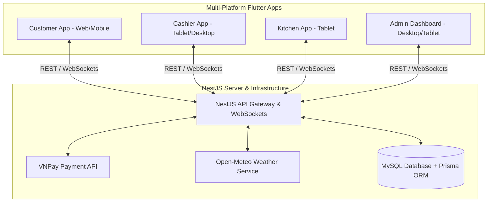

# Food Canteen Management System (ROMS) - Presentation Pitch Deck

## 1. Executive Summary & Core Problems Solved

In traditional canteens and restaurants, operations are plagued by fragmented communication, slow ordering cycles, payment reconciliation errors, and lack of real-time business visibility. 

ROMS (Restaurant Order Management System) solves these challenges through a unified, real-time ecosystem:
*   **Inefficient Order Collection:** Eliminates long queues and manual ordering mistakes using self-service Table QR Code ordering for customers.
*   **Communication Gaps (Kitchen vs. Front-of-House):** Real-time WebSocket sync prevents kitchen staff from missing order modifications or custom preferences (e.g., specific toppings, side requests).
*   **Payment Reconciliation Delays:** Integrates digital gateways like VNPay alongside Cash/Card, automatically syncing transactions with live KPI calculations.
*   **Operational Blind Spots:** Provides restaurant owners with instant, accurate analytics, active kitchen loads, and resource scheduling.

---

## 2. System Architecture

The ROMS ecosystem is built on a modern, decoupled architecture designed for high performance, real-time synchronization, and reliability:

*   **Frontend (Flutter):** A single codebase delivering responsive, tailormade user experiences across multiple platforms (Web, Mobile, Desktop, Tablet) using Riverpod for clean state management.
*   **Backend (NestJS + TypeScript):** A modular backend server utilizing REST APIs and WebSockets (Socket.io) for instant, low-latency cross-device communications.
*   **Database (MySQL + Prisma ORM):** A relational database storing transactional orders, menu catalogs, staff permissions, and session timelines with deep-equal object comparisons.

---

## 3. The 4 Core Modules

ROMS is divided into 4 key operational modules:

### 1. Customer Self-Service Module
*Target Users: Restaurant/Canteen Diners*
*   **QR-Code Table Join:** Allows customers to join an active dining session by scanning a table-specific QR code.
*   **Intelligent Cart Merging:** Cart items with identical customization attributes (e.g., `Cơm cà ri gà` with both `Có canh` and `Thêm trứng`) are automatically merged, increasing the quantity layer instead of creating duplicate line items.
*   **Hybrid Checkout Flow:** Offers frictionless VNPay integration or manual Cashier approval requests.

### 2. Cashier Operations Module
*Target Users: Front-of-House Staff & Cashiers*
*   **Interactive Floor & Table Grid:** Provides a visual overview of occupied, open, and billing-pending tables.
*   **Order Modifier Console:** Enables cashiers to add, edit, or adjust quantities and specific toppings/notes of items on behalf of customers.
*   **Multi-Channel Payment Settlement:** Settles payments through Cash, Card, Bank Transfer, or VNPay with built-in partial payment handling.

### 3. Kitchen Batching Module
*Target Users: Kitchen Chefs & Cooks*
*   **Live Order Queue:** Incoming orders are grouped into preparation batches dynamically.
*   **Customization Visualizer:** Clearly renders item customization tags (e.g., `+ Canh`, `+ Trứng`) in a prominent, readable layout so chefs never miss specific prep instructions.
*   **Batch Status Progression:** Seamless transition from `preparing` to `completed` with instant notifications pushed to the Cashier and Customer interfaces.

### 4. Admin Management & Analytics Module
*Target Users: Restaurant Owners & Managers*
*   **Real-time Analytics Dashboard:** Live KPI calculations (Total Revenue, Average Order Value, Total Sessions) that dynamically recalculate as payments settle.
*   **Hourly Heatmap & Product Velocity:** Identifies peak hours and categorizes menu items into "Best Sellers" vs. "Needs Attention" (Worst Sellers).
*   **7-Day Weather & Location Forecast:** Renders a 7-day local meteorological forecast right on the dashboard page next to the restaurant location, allowing managers to anticipate customer footfall fluctuations based on the weather.
*   **Employee Directory & Role Management:** Secure Employee Directory supporting single-role assignments (e.g., Manager, Cashier, Kitchen, Staff) with auto-exclusion constraints (graying out other options to enforce exactly one role).
*   **Self-Deactivation Guard:** Hardcoded protection preventing active logged-in admins from self-deactivating their own accounts, while still permitting them to manage other staff.

---

## 4. Key Highlights & Edge-Case Engineering

*   **Precise Currency Arithmetic:** All transactions are processed in minor units (VND * 100) to bypass floating-point errors, ensuring accounting accuracy across payments and admin stats.
*   **Robust Deep-Equal Checks:** Handles MySQL JSON key reordering dynamically to ensure accurate identical-item merging.
*   **Security & RBAC:** Enforces strict role-based access control, preventing lower-tier staff from accessing restricted revenue reports or admin configurations.
